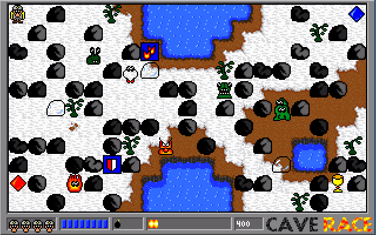

# CaveRace

CaveRace is a maze-based action game created in 1997 by Clemens Schotte and
fellow students. Inspired by *[Dyna Blaster]* (*Bomberman*), the game sends miners
into the caves of Eldora to collect gold and diamonds, clear passages with
bombs, and defeat alien invaders.

| Forest | Winter | Lava |
| --- | --- | --- |
|  |  |  |

More screenshots, background information, and a download of the original
MS-DOS release are available on the [CaveRace website].

## The modern Odin version

CaveRace 1.5 is an in-progress rewrite in [Odin] using the bundled [raylib]
bindings. Its goal is to bring the game back to modern Windows and macOS
systems while preserving the original levels, artwork, sounds, and feel.

See [Odin/README.md](Odin/README.md) for the current status, controls, build
instructions, and source layout.

## Repository layout

| Path | Contents |
| --- | --- |
| [`Odin/`](Odin/) | Modern CaveRace 1.5 rewrite and converted runtime assets |
| [`Source/`](Source/) | Original MS-DOS CaveRace and MapEditor C source |
| [`Artwork/`](Artwork/) | Original IFF artwork and converted PNG files |

## Original MS-DOS version

CaveRace 1.2 targets an Intel 80386-compatible IBM PC running MS-DOS with a
320×200, 256-color VGA display (Mode 13h). It is written mainly in C, with x86
assembly routines for memory and graphics. The game and MapEditor were built
with Borland C 3.1.

The original game uses the mouse and keyboard. Its loop is synchronized to the
display refresh rate, and unlike later Windows versions, it has no sound.

### Building the original source

Install [Borland C 3.1](https://en.wikipedia.org/wiki/Borland_C%2B%2B), set the IDE working directory to the project folder, and
build CaveRace or MapEditor from the sources in [`Source/`](Source/). This is a
historical toolchain intended for an MS-DOS environment or a compatible
emulator.

### Cheats and launch options

Start the MS-DOS game with `-powerblast` to enable the function-key cheats.

| Key | Result |
| --- | --- |
| F1 | Next level |
| F2 | Maximum health |
| F3 | Maximum bombs |
| F4 | Increase bomb power |
| F5 | Double points |
| 1 | Save a screenshot as `screen.raw` |
| % | Show rendering time |

The `-slow` option speeds up the game on older, slower systems. The Odin port
recognizes both original command-line options for compatibility.

## Original graphics

Marijn Schotte created the artwork on an Amiga with [Deluxe Paint]. The source
art uses the IFF (Interchange File Format). For the MS-DOS game, screens and
16×16 tiles were converted to a raw, indexed graphics format using a shared
256-color RGB palette.

| File | Content | Bytes | Description |
| --- | --- | ---: | --- |
| BGS | 5 × 50 tiles (16×16) | 64,000 | Backgrounds |
| BOM | 17 tiles (16×16) | 4,352 | Bombs |
| CAR | 320×200 screen | 64,000 | Title card |
| ENM | 16 tiles (16×16) | 4,096 | Enemies |
| FNT | 36 glyphs (3×5) | 540 | Font |
| HIS | 320×200 screen | 64,000 | High scores |
| ITM | 13 tiles (16×16) | 3,328 | Items |
| MAN | 18 tiles (16×16) | 4,608 | Player |
| MN1 | 320×200 screen | 64,000 | Menu 1 |
| MN2 | 320×200 screen | 64,000 | Menu 2 |
| PAL | 256 RGB entries | 768 | Palette |
| STS | 4 tiles (16×16) | 1,024 | Status |
| TRS | 6 tiles (16×16) | 1,536 | Treasure |

## Version history

| Version | Year | Platform | Language | Graphics API |
| --- | ---: | --- | --- | --- |
| 1.2 | 1997 | MS-DOS | Borland C and x86 assembly | VGA Mode 13h |
| 1.3 | 2002 | Windows | C | DirectX 8.1 |
| 1.4 | 2012 | Windows | C# | SharpDX |
| 2.0 | 2012 | Windows Phone 7 and Xbox | C# | XNA |
| 1.5 | 2026 | Windows and macOS | Odin | raylib 6 |

## Credits

Original CaveRace 1.0 team:

- Clemens Schotte — code and concept
- Harro Lock — code
- Marijn Schotte — artwork
- Paul Bosselaar — documentation
- Paul van Croonenburg — documentation

From version 1.3 onward, CaveRace was developed by Clemens Schotte with artwork
by Marijn Schotte.

## License

Copyright © 1997–2026 NavaTron B.V.

The source code is licensed under the [Apache License 2.0](LICENSE).

[CaveRace website]: https://caverace.com/
[Dyna Blaster]: https://en.wikipedia.org/wiki/Bomberman_%281990_video_game%29
[Deluxe Paint]: https://en.wikipedia.org/wiki/Deluxe_Paint
[Odin]: https://odin-lang.org/
[raylib]: https://www.raylib.com/
