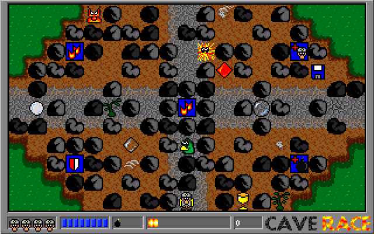
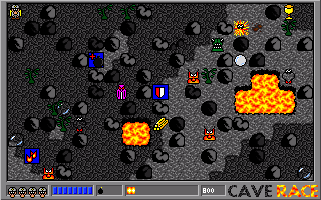
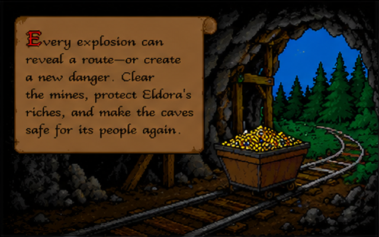
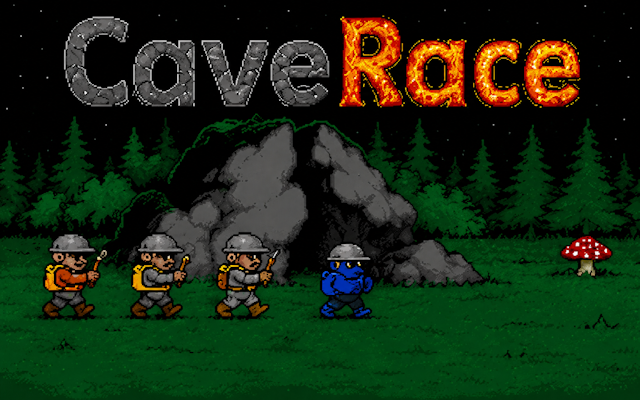
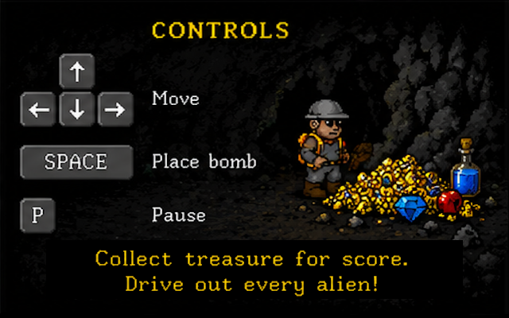

# CaveRace

CaveRace is a maze-based action game created in 1997 by Clemens Schotte and
fellow students. Inspired by *[Dyna Blaster]* (*Bomberman*), the game sends miners
into the caves of Eldora to collect gold and diamonds, clear passages with
bombs, and defeat alien invaders.

| Forest | Winter | Lava |
| --- | --- | --- |
|  |  |  |

More screenshots, background information, and a download of the original
MS-DOS release are available on the [CaveRace] website.

## Story of CaveRace

Far out in space lies Eldora, a small planet whose people have built their lives
around its treasure-filled mines. Day after day, the miners venture underground
to recover gold, diamonds, and other precious minerals hidden deep within the
caves.

Then unexpected visitors arrive from outer space. Alien creatures invade the
mines, threatening Eldora's people and the riches they depend on. The miners
have only one practical defense: the same explosives they use to open passages
through the rock.

You are one of those miners. Enter the infested caves, collect as much treasure
as you can, and drive out every alien. Your bombs can clear softer stone and
destroy nearby monsters, but the caves reward careful planning: dense rock will
not move, and a careless blast can destroy treasure or a valuable power-up.

Every explosion can reveal a route or create a new danger. Clear the mines,
protect Eldora's riches, and make the caves safe for its people again.

## The modern rewrite

CaveRace 1.5 is a rewrite in [Odin] using the bundled [raylib] bindings,
now available as a public beta for Windows and macOS. Its goal is to bring
the game back to modern systems while preserving the original levels,
artwork, sounds, and feel.

Get the latest build from ... link follows

| Story | Main menu | Controls |
| --- | --- | --- |
|  |  |  |

## Version guides

Every preserved CaveRace version has its own README with version-specific
requirements, build instructions, controls, source layout, and compatibility
notes. **1.5 is the only actively developed edition and the recommended
download**; 1.2, 1.3, 1.4, and 2.0 are kept for historical reference.

| Version | Year | Platform and technology | Documentation |
| --- | --- | --- | --- |
| 1.2 | 1997 | Original MS-DOS release, written for Borland C with x86 assembly | [CaveRace 1.2 README](<1.2 Original (MS-DOS)/README.md>) |
| 1.3 | 2002 | Windows port using Visual C++ and DirectX 8.1 | [CaveRace 1.3 README](<1.3 DirectX (Windows)/README.md>) |
| 1.4 | 2012 | Windows 8 Store app written in C# with SharpDX | [CaveRace 1.4 README](<1.4 SharpDX (Windows)/README.md>) |
| 2.0 | 2012 | C# and XNA edition for Windows, Windows Phone, and Xbox 360 | [CaveRace 2.0 README](<2.0 XNA (Windows Phone & XBox)/README.md>) |
| **1.5 (beta)** | 2026 | Modern Windows and macOS rewrite using Odin and raylib |

## Original MS-DOS version

CaveRace 1.2 targets an Intel 80386-compatible IBM PC running MS-DOS with a
320×200, 256-color VGA display (Mode 13h). It is written mainly in C, with x86
assembly routines for memory and graphics. The game and MapEditor were built
with Borland C 3.1.

The original game uses the mouse and keyboard. Its loop is synchronized to the
display refresh rate, and unlike later Windows versions, it has no sound.

### Building the original source

Install [Borland C] 3.1, set the IDE working directory to the project folder, and
build CaveRace or MapEditor from the sources in
[`1.2 Original (MS-DOS)/source/`](<1.2 Original (MS-DOS)/source/>). This is a
historical toolchain intended for an MS-DOS environment or a compatible
emulator.

### Cheats and launch options

Start the MS-DOS game with `-powerblast` to enable the function-key cheats.

| Key | Result |
| --- | --- |
| F1 | Next level |
| F2 | Maximum health |
| F3 | Maximum bombs |
| F4 | Increase bomb power |
| F5 | Double points |
| 1 | Save a screenshot as `screen.raw` |
| % | Show rendering time |

The `-slow` option speeds up the game on older, slower systems.

## Original graphics

Marijn Schotte created the artwork on an Amiga with [Deluxe Paint]. The source
art uses the IFF (Interchange File Format). For the MS-DOS game, screens and
16×16 tiles were converted to a raw, indexed graphics format using a shared
256-color RGB palette.

| File | Content | Bytes | Description |
| --- | --- | ---: | --- |
| BGS | 5 × 50 tiles (16×16) | 64,000 | Backgrounds |
| BOM | 17 tiles (16×16) | 4,352 | Bombs |
| CAR | 320×200 screen | 64,000 | Title card |
| ENM | 16 tiles (16×16) | 4,096 | Enemies |
| FNT | 36 glyphs (3×5) | 540 | Font |
| HIS | 320×200 screen | 64,000 | High scores |
| ITM | 13 tiles (16×16) | 3,328 | Items |
| MAN | 18 tiles (16×16) | 4,608 | Player |
| MN1 | 320×200 screen | 64,000 | Menu 1 |
| MN2 | 320×200 screen | 64,000 | Menu 2 |
| PAL | 256 RGB entries | 768 | Palette |
| STS | 4 tiles (16×16) | 1,024 | Status |
| TRS | 6 tiles (16×16) | 1,536 | Treasure |

## Credits

Original CaveRace 1.0 team:

- [Clemens Schotte](https://www.linkedin.com/in/cschotte/) — code and concept
- [Marijn Schotte](https://www.linkedin.com/in/marijn-schotte-a224a2216/) — artwork and concept
- [Paul Bosselaar](https://www.linkedin.com/in/paul-bosselaar/) — documentation
- [Paul van Croonenburg](https://www.linkedin.com/in/paul-van-croonenburg-0a389843/) — documentation
- Harro Lock — code

From version 1.3 onward, CaveRace was developed by Clemens Schotte with artwork
by Marijn Schotte.

## License

Copyright © 1997–2026 NavaTron B.V.

The source code is licensed under the [Apache License 2.0](LICENSE).

[CaveRace]: https://caverace.com/
[Dyna Blaster]: https://en.wikipedia.org/wiki/Bomberman_%281990_video_game%29
[Deluxe Paint]: https://en.wikipedia.org/wiki/Deluxe_Paint
[Odin]: https://odin-lang.org/
[raylib]: https://www.raylib.com/
[Borland C]: https://en.wikipedia.org/wiki/Borland_C%2B%2B
